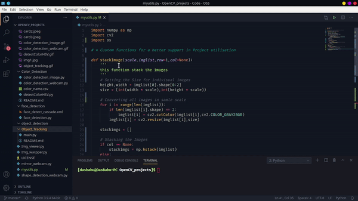

#
**<H1 align = "center">OpenCV Projects</H1>**

## Description

**Author** : Susovan Das

**Language** : Python  

**External Module** : [OpenCV](https://opencv.org/), [Numpy](https://numpy.org/), [Pandas](https://pypi.org/project/pandas/)

This Repository contents some projects on Computer Vision using OpneCV libary of python.

All Projects are Listed here

* [Color Detection](Color_Detection/)
* [Object Detection](Object_Detection/)
* [Object Tracking](Object_Tracking/)
* [Shape Detection](###-shape-detection)
* [Image Wrap Prespective View](###-image-wrap-prespective-view)
* [Utils File](###-utils-file)
* [WebCam](###-webcam)

### Shape Detection


In this we are detecting the shapes of object by using OpenCV methods.

To download this file Click this --> &nbsp; &nbsp; [][DownGit-shape_detection]

You can run this by simply double clicking the _image_warp_prespective.py_.  
Or you can use the Command Prompt/Terminal and go to the location of the _image_warp_prespective.py_ and type `python image_warp_prespective.py.py`.

A window will came out named _Shape Detection_. There are 4 parameters _Threshold 1_, _Threshold 2_, _Min Area_, _Max Area_. To change this parameters you have to use the Track Pad, by changing this value selet the optimal value to detect the shapes of the object.

To exit press _ESC_ button.
<br>

### Image Wrap Prespective View


In this we are creating a bird eye view of a object from a image.

To download this file Click this --> &nbsp; &nbsp; [][DownGit-image_warp_prespective]

You can run this by simply double clicking the _image_warp_prespective.py_.  
Or you can use the Command Prompt/Terminal and go to the location of the _image_warp_prespective.py_ and type `python image_warp_prespective.py`.  
A window will came out named _Main Image_ form that select the 4 points in _Z_ pattern for which object you want the Bird Eye View.

To exit press _ESC_ button.

### Utils File

This is a _.py_ file which contains some useful and important functions

|**Function Name**|**Preview**|
|---|---|
|stackImage()||

To download this file Click this --> &nbsp; &nbsp; [][DownGit-myUtils]

### WebCam

This is a simple _python_ program to access the webcam.

To download this file Click this --> &nbsp; &nbsp; [][DownGit-WebCam]

## How to Download

To download all this project Click this --> &nbsp; &nbsp; [][DownGit-main]

## Requirements

This project requir some external modules.
* OpenCV
* Numpy
* Pandas

So use the package manager [pip](https://pypi.org/project/pip/) to install those package.

```bash
pip install opencv-contrib-python
pip install numpy
pip install pandas
```

<!--Inner Links-->
[DownGit-main]: https://minhaskamal.github.io/DownGit/#/home?url=https://github.com/SusovanGithub/OpenCV-Projects

[DownGit-image_warp_prespective]: https://minhaskamal.github.io/DownGit/#/home?url=https://github.com/SusovanGithub/OpenCV-Projects/blob/master/image_warp_prespective.py

[DownGit-shape_detection]: https://minhaskamal.github.io/DownGit/#/home?url=https://github.com/SusovanGithub/OpenCV-Projects/blob/master/shape_detection.py

[DownGit-myUtils]: https://minhaskamal.github.io/DownGit/#/home?url=https://github.com/SusovanGithub/OpenCV-Projects/blob/master/myUtils.py

[DownGit-WebCam]: https://minhaskamal.github.io/DownGit/#/home?url=https://github.com/SusovanGithub/OpenCV-Projects/blob/master/webcam.py
